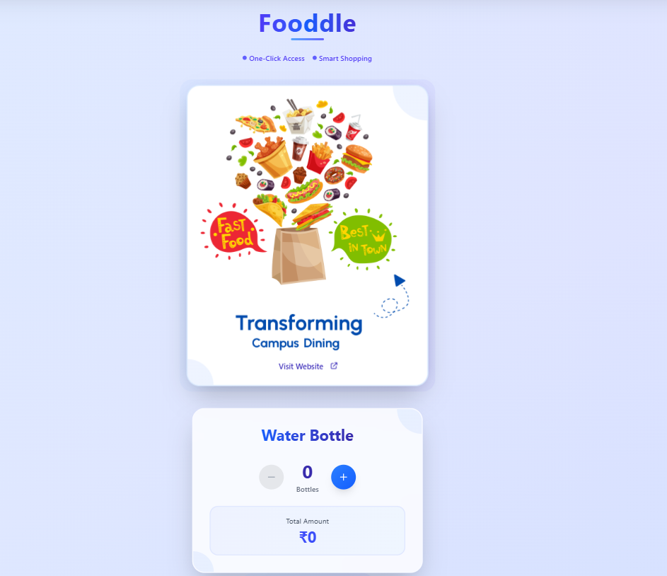
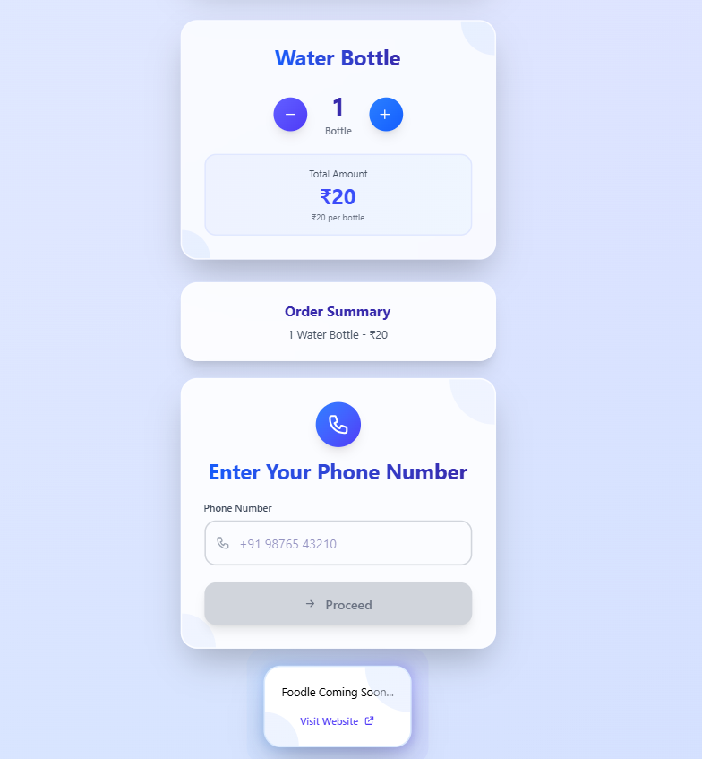

# **Fooddle - Smart Campus Dining**

## **Overview**
Fooddle is a smart food ordering platform designed to simplify campus dining.  
At our campus event, we **used Fooddle to sell water bottles online**.  
Students selected quantity, entered their phone number, and were redirected to a **payment app** to complete the order.

---

## **How It Works**
1. Select product (water bottle)  
2. Choose quantity (+ / –)  
3. Enter phone number  
4. Redirected to payment app for transaction  
5. Order confirmed  

---

## **Live Link**
 [Fooddle](https://fooddle-jal.vercel.app/)

---

## **Interface (Scrollable Page)**

  
  

